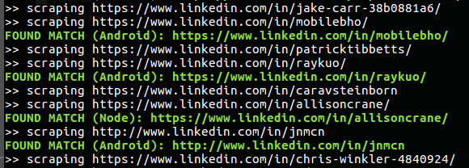

# LinkedIn Scraper

Uses [scrapedin](https://github.com/linkedtales/scrapedin) and [puppeteer](https://github.com/puppeteer/puppeteer) to search through a given list of LinkedIn profiles for specified keywords.



## Quickstart

#### Requirements

- Node (tested with `12.16.1 LTS`)
- npm (tested with `6.14.1`)

#### Clone repo
```
git clone --depth=1 https://github.com/jsh33hy/linkedin-scraper.git <project_name>
cd <project_name>
```

#### Setup config

Edit the [config file](./config/config.json) to include your credentials, keywords to match, and LinkedIn profile urls
```json
    // login credentials
    "credentials":{
        "email": "{YOUR-EMAIL}",
        "password": "{YOUR-PASSWORD}"
    },
    //  launch in headless mode (no browser popup)
    "headless": true,
    //  keywords to search for
    "keywords":[
        "Android",
        "Node"
    ],
    //  urls to scrape
    "urls": [       
        "https://www.linkedin.com/in/some-user/",
        "https://www.linkedin.com/in/some-other-user/",
    ]
}
```

#### Build + Run
```sh
npm install // NOTE: puppeteer package is > 100 MB
npm start
```

## Using Docker
```sh
git clone --depth=1 https://github.com/jsh33hy/linkedin-scraper.git <project_name>
cd <project_name>
## build image
docker build --tag js/linkedin-scraper .
## create container
docker create --name js-linkedin-scraper --mount type=bind,source="$(pwd)"/config,target=/var/workdir/config --tty js/linkedin-scraper
## start container
docker start js-linkedin-scraper --attach
## Note: you can make changes to the config.json file and then restart an existing container
```

## Todo
- Add support for cookies auth instead of credentials